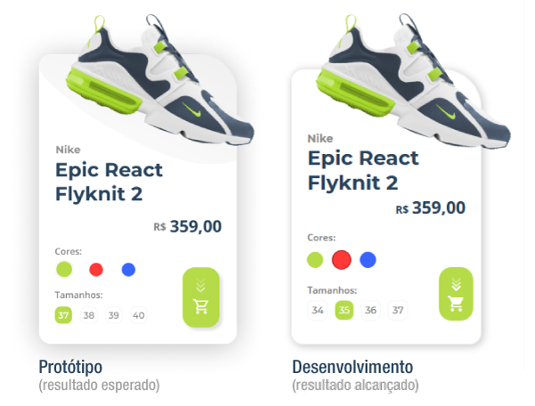

# Desafio CSS - Papo de Dev #

O desafio era desenvolver um card de exibição de produto para e-commerce, com opções de cores e tamanhos.

___

___
### Tarefas ###
- [x] Criar estrutura HTML 
- [x] Importar fontes e inserir imagens
- [x] Posicionar elementos
- [x] Implementar seleção de cor e tamanho
- [ ] Exibir a sombra abaixo da imagem do tênis
- [ ] Alterar a imagem de acordo com a seleção de cores
- [ ] Refatorar o código

